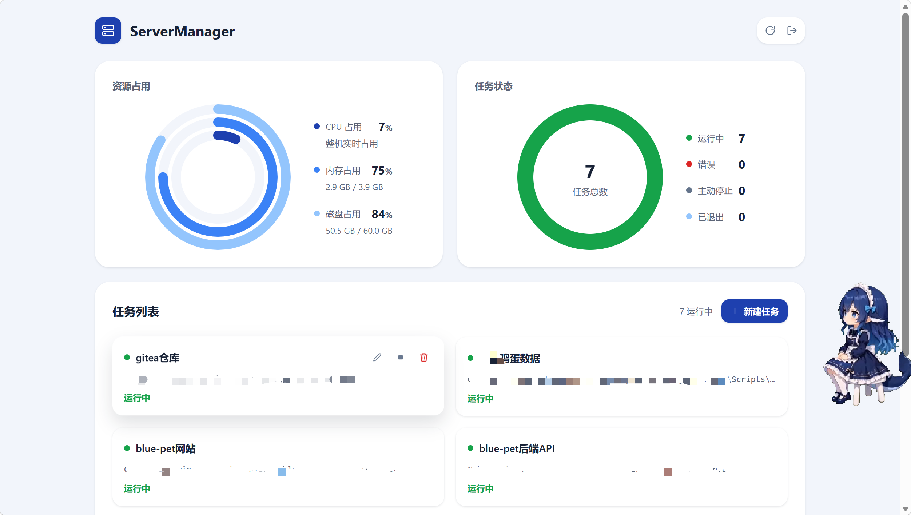

# ServerManager

一个轻量的服务器任务管理面板：Rust 后端 + React 前端，在浏览器中统一管理常驻进程，并实时查看服务器资源占用。



## 功能

- **密钥登录**：管理界面需通过登录密钥访问，会话滑动续期，并带登录限速与 IP 锁定保护
- **持久化任务**：以命令行方式挂载常驻任务，任务列表持久化到 SQLite（WAL 模式），创建/编辑/删除/状态变更均实时写库；服务重启后自动恢复任务列表，重启前处于运行中的任务自动重新拉起，其余状态原样保留
- **智能命令解析**：启动前按规则拼接工作目录与命令——命令为相对路径且「工作目录/命令」存在时以拼接后的完整路径执行，否则按原命令执行，兼容 PATH 命令与绝对路径
- **控制台输出**：实时读取任务进程最近 500 行标准输出/错误
- **异常感知**：进程错误退出后任务不消失，以红点标记错误状态，可查看程序最后的输出
- **资源监控**：环形卡片近似实时展示 CPU、内存、磁盘占用
- **任务总览**：环形图展示运行中 / 错误 / 主动停止 / 已退出的任务分布，支持新建、编辑、停止、删除任务

## 技术栈

| 层 | 技术 |
| --- | --- |
| 后端 | Rust · axum · rusqlite (SQLite) · sysinfo · tokio |
| 前端 | React 19 · TypeScript · Vite · Tailwind CSS 4（SPA，构建为静态资源由后端托管） |

## 快速开始

### 环境要求

- Rust 工具链（stable）
- Node.js 与 npm

### 一键构建（Windows）

```bat
build.bat
```

自动完成：打包前端 → 编译后端 (release) → 将 `server-manager.exe` 复制到项目根目录。PowerShell 用户可使用 `build.ps1`。

### 手动构建

```bash
# 前端
cd frontend
npm install
npm run build

# 后端
cd ..
cargo build --release
```

### 配置与运行

复制配置模板并按需修改：

```bash
copy config.toml.example config.toml
```

`config.toml` 关键项：

```toml
[server]
host = "127.0.0.1"      # 监听地址
port = 9999             # 监听端口
static_dir = "frontend/dist"
db_path = "data.db"     # SQLite 数据库文件（任务持久化）

[auth]
key = "请修改为你的登录密钥"   # 为空时服务拒绝启动
session_ttl_minutes = 1440   # 会话有效期（滑动续期）
login_window_secs = 60       # 登录限速窗口（秒）
max_attempts_per_window = 5  # 窗口内最大尝试次数
max_failures = 5             # 连续失败次数达到后锁定 IP
lock_minutes = 15            # IP 锁定时长（分钟）
```

启动：

```bash
server-manager.exe            # 默认读取 config.toml
server-manager.exe my.toml    # 指定配置文件
```

浏览器访问 `http://127.0.0.1:9999`（按实际端口），使用密钥登录后即可管理任务。

## 项目结构

```
├── src/            # Rust 后端（auth / config / db / stats / tasks / static_files）
├── frontend/       # React 前端（Vite + Tailwind）
├── config.toml.example  # 配置模板
├── build.bat / build.ps1  # 一键构建脚本
└── docs/image.png  # 界面截图
```

## 许可证

本项目基于 [CC BY-NC-SA 4.0](https://creativecommons.org/licenses/by-nc-sa/4.0/deed.zh-hans) 协议发布：署名、非商业性使用、相同方式共享。
